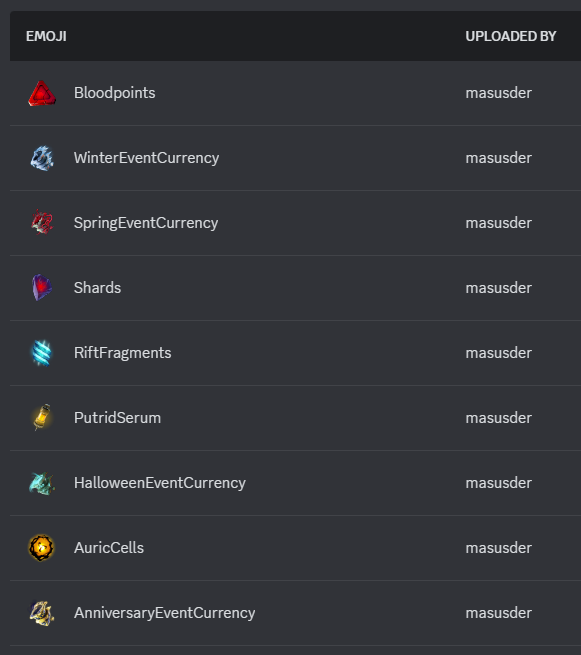

# DBDInfoBot

[](https://opensource.org/license/mit)
[](https://crowdin.com/project/dbdinfo-discord-bot)
[](https://discord.gg/dbdleaks)
<a href="https://www.dbd-info.com/" target="_blank">
    
</a>
<a href="https://discord.com/" target="_blank">
    
</a>
<br/>
A powerful Discord bot built for the [DBDInfo](https://www.dbd-info.com/) project.

## Features
- **Seamless Integration**: Brings live updates and data from the DBDInfo project to your Discord server.
- **Real-Time Updates**: Stay up to date with the latest Dead by Daylight news and info.
- **User-Friendly**: Simple to use for members.

## Links
- 🌐 [Visit the DBDInfo Website](https://www.dbd-info.com/)
- 💬 [Join the Discord Community](https://discord.gg/dbdleaks)

## Installation

### Add the Bot to Your Server
Click the link below to invite the bot to your Discord server:  
👉 [Invite DBDInfoBot](https://discord.com/oauth2/authorize?client_id=1296552447208063139)

---

## Run the Bot Locally

Follow these steps to set up and run the bot locally:

### 1. Clone the Repository

First, clone the repository and navigate into the project folder:

```bash
git clone https://github.com/Masusder/DBDInfoBot.git
cd DBDInfoBot
```

### 2. Install Dependencies
Install the required Node.js packages:

```bash
npm i
```

### 3. Configure Environment Variables
1. Copy the example environment file to create a .env file:

```bash
cp .env.example .env
```

2. Open the .env file and update the values.

### 4. Register Commands with Discord
Before running the bot, you need to register the commands to Discord. Run the following script to register the bot's commands:

```bash
npm run register
```

This step ensures that the bot's slash commands are registered with Discord.

### 5. Upload Static Emojis
Some commands require static emojis to function correctly. Upload the necessary static emojis to the bot's emoji list in the Discord Developer Portal before running the bot:



### 6. Run the Bot
Start the bot in development mode:

```bash
npm run dev
```

Once the bot starts, you should see logs indicating it is online and running.